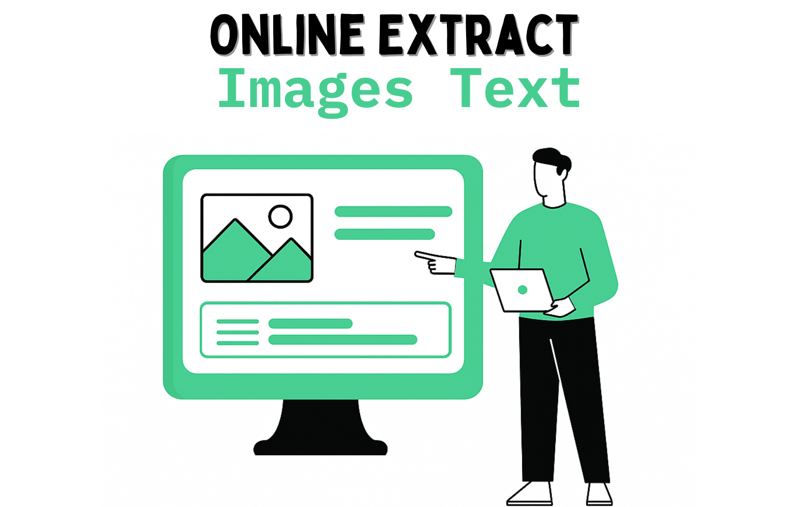

<p align="center">
  
</p>

# Online Extract Images Text

## 📋 Descrição do Projeto
Este projeto de Iniciação Científica automatiza o fluxo completo de captura, conversão, tratamento e extração de texto de imagens presentes em páginas web utilizando técnicas de web scraping, OCR (Reconhecimento Óptico de Caracteres) e análise inteligente de conteúdo com IA.

## ⚙️ Funcionalidades

### 🔍 Captura e Processamento de Imagens (app.py)
- **Download automatizado**: Captura todas as imagens de uma página web (exceto logos) usando web scraping
- **Conversão de formatos**: Converte automaticamente:
  - Formatos suportados pelo Pillow (JPG, PNG, GIF, BMP, TIFF, WEBP, ICO) para PNG
  - Arquivos SVG para PNG usando CairoSVG
- **Tratamento de imagens**: Aumenta o contraste (fator 2.0) para melhorar a legibilidade do OCR
- **Reconhecimento de texto (OCR)**: Utiliza EasyOCR com suporte ao português para extrair texto das imagens
- **Limpeza automática**: Remove arquivos antigos e imagens sem texto detectado

### 🤖 Análise Inteligente de Conteúdo (prompt.py)
- **Saneamento de dados**: Utiliza IA para avaliar a utilidade dos textos extraídos
- **Análise detalhada**: Gera análises estruturadas com:
  - Título do conteúdo
  - Público-alvo identificado
  - Objetivo do texto
  - Análise detalhada e profunda
  - Correção de erros textuais
- **Geração de relatórios**: Cria documentos PDF completos com imagens e análises

## 📂 Estrutura de Diretórios

```
├── 1_imagens_baixadas/      # Imagens originais baixadas da web
├── 2_imagens_convertidas/   # Imagens convertidas para PNG
├── 3_imagens_tratadas/      # Imagens com contraste aumentado
├── 4_resultados_ocr/        # Textos extraídos pelo OCR
├── 5_resultados_saneados/   # Textos filtrados como úteis pela IA
├── 6_documentos_gerados/    # Relatórios PDF finais
├── credenciais/             # Configurações de API (criado automaticamente)
├── fonts/                   # Fontes para geração de PDFs
├── programas/               # Dependências externas
├── app.py                   # Script principal de processamento
├── prompt.py                # Módulo de análise com IA
└── README.md                # Este arquivo
```

## 🚀 Tecnologias e Bibliotecas

### Processamento de Imagens e Web Scraping
- **Python 3.8+**
- **Requests**: Captura de conteúdo HTML e download de imagens
- **BeautifulSoup4**: Parsing de HTML para localizar tags ``
- **Pillow (PIL)**: Manipulação e conversão de imagens
- **CairoSVG**: Conversão de SVG para PNG
- **EasyOCR**: Reconhecimento óptico de caracteres

### Análise de Dados e IA
- **NumPy**: Manipulação de arrays e dados
- **Requests**: Comunicação com APIs de IA
- **AST**: Parsing seguro de respostas estruturadas
- **JSON**: Manipulação de dados estruturados

### Geração de Documentos
- **FPDF**: Criação de documentos PDF
- **Fontes DejaVu**: Suporte a caracteres especiais em PDFs

## 🔧 Requisitos de Instalação

1. **Clone o repositório:**
   ```bash
   git clone https://github.com/seu-usuario/online_extract_images_text.git
   cd online_extract_images_text
   ```

2. **Crie e ative um ambiente virtual:**
   ```bash
   python3 -m venv venv
   source venv/bin/activate  # Linux/macOS
   venv\Scripts\activate     # Windows
   ```

3. **Instale as dependências:**
   ```bash
   pip install -r requirements.txt
   ```

## ⚙️ Configuração

### Configuração da API de IA (Obrigatória para análise completa)

O sistema criará automaticamente o arquivo `credenciais/credenciais.json`. Edite-o com suas credenciais:

```json
{
    "url": "https://sua-api-ia.com/endpoint",
    "apiKey": "sua-chave-da-api"
}
```

**Nota**: Sem as credenciais configuradas, apenas o OCR funcionará. A análise inteligente e geração de PDFs requer uma API compatível com GPT-4.

## ▶️ Como Executar

1. **Configure a URL alvo** no arquivo `app.py`:
   ```python
   site = "https://sua-url-alvo.com"
   ```

2. **Execute o processamento completo:**
   ```bash
   python app.py
   ```

### Fluxo de Execução Completo:
1. 🧹 Limpeza de arquivos anteriores
2. 🌐 Download de todas as imagens da URL configurada
3. 🔄 Conversão de formatos (SVG → PNG, outros → PNG)
4. 🎨 Tratamento de imagens (aumento de contraste)
5. 👁️ Aplicação de OCR (EasyOCR)
6. 🤖 Análise de utilidade com IA
7. 📊 Análise detalhada do conteúdo
8. 📄 Geração de relatórios PDF

## 🔄 Personalização

### Configurações Principais
- **URL alvo**: Modifique a variável `site` em `app.py`
- **Fator de contraste**: Ajuste `fator_contraste` na função `treat_image()`
- **Idiomas OCR**: Configure `easyocr.Reader(['pt', 'en'])` conforme necessidade
- **Modelo de IA**: Altere `modelOverride` em `gerar_resposta_gpt()`

### Formatos Suportados
```python
# Pillow (conversão direta)
pillow_supported_extensions = [".jpg", ".jpeg", ".png", ".gif", ".bmp", ".tiff", ".webp", ".ico"]

# CairoSVG (conversão SVG)
cairo_svg_supported_extensions = [".svg"]
```

## 📊 Resultados

O sistema gera três tipos principais de saída:

1. **Textos OCR** (`4_resultados_ocr/`): Texto bruto extraído das imagens
2. **Textos Saneados** (`5_resultados_saneados/`): Apenas textos considerados úteis pela IA
3. **Relatórios PDF** (`6_documentos_gerados/`): Documentos completos com:
   - Imagem original
   - Análise detalhada
   - Texto corrigido
   - Dimensões da imagem
   - Metadados do processamento

📎 **Exemplo de resultado gerado**:  
Veja um exemplo real de saída do sistema no arquivo [`exemplo_resultado.pdf`](./exemplo_resultado.pdf), localizado na raiz do projeto.  
Este arquivo ilustra o conteúdo final com todos os elementos inseridos automaticamente.

## 🤝 Contribuição

Contribuições são bem-vindas! Para colaborar:

1. Fork do repositório
2. Crie uma branch feature: `git checkout -b feature/nova-funcionalidade`
3. Commit das alterações: `git commit -m "feat: adiciona nova funcionalidade"`
4. Push para a branch: `git push origin feature/nova-funcionalidade`
5. Abra um Pull Request

## 🐛 Solução de Problemas

### Problemas Comuns

**Erro de conversão SVG**: Instale as dependências do Cairo
```bash
# Ubuntu/Debian
sudo apt-get install libcairo2-dev

# macOS
brew install cairo
```

**Erro no EasyOCR**: Primeira execução demora devido ao download de modelos

**Erro na API de IA**: Verifique as credenciais em `credenciais/credenciais.json`

## 📝 Licença

Este projeto está sob a licença MIT. Consulte o arquivo `LICENSE` para mais detalhes.

## 🎓 Créditos

> Desenvolvido como projeto de Iniciação Científica - Centro Universitário Nossa Senhora do Patrocínio (Ceunsp)

---

**Versão**: 1.0  
**Última atualização**: Janeiro 2025
